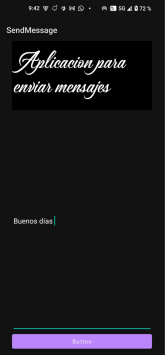
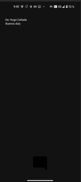

# SendMessage 📱

**SendMessage** es una aplicación de Android desarrollada en **Kotlin** que permite redactar un mensaje de texto en una pantalla principal (`SendMessageActivity`) y transmitirlo a una segunda pantalla (`ViewMessageActivity`) utilizando el mecanismo de comunicación de Android mediante `Intent` y `Bundle`.

---

## 📌 Índice
1. [Estructura del Proyecto y Decisiones de Diseño](#-estructura-del-proyecto-y-decisiones-de-diseño)
2. [Demostración de la Aplicación en Ejecución](#-demostración-de-la-aplicación-en-ejecución-obligatorio)
3. [Proceso de Depuración y Evidencias de Logcat](#-proceso-de-depuración-y-evidencias-de-logcat-obligatorio)
4. [Conexión al directorio `/data/data/`](#-conexión-al-directorio-datadata)
5. [Enlaces a la Documentación Oficial de Android](#-enlaces-a-la-documentación-oficial-de-android)

---

## 🏗️ Estructura del Proyecto y Decisiones de Diseño

El proyecto sigue la arquitectura recomendada por Google para aplicaciones Android sencillas basadas en **Actividades**:

```text
SendMessage/
├── app/
│   ├── src/main/
│   │   ├── java/com/example/sendmessage/
│   │   │   ├── SendMEssageApplication.kt  # Clase de aplicación principal
│   │   │   ├── SendMessageActivity.kt      # Pantalla principal para escribir mensaje
│   │   │   └── ViewMessageActivity.kt      # Pantalla secundaria para visualizar mensaje
│   │   ├── res/
│   │   │   ├── layout/
│   │   │   │   ├── activity_send_message.xml # Layout XML de la pantalla de envío
│   │   │   │   └── activity_view_message.xml # Layout XML de la pantalla de visualización
│   │   │   ├── values/                      # Colores, cadenas y temas
│   │   │   └── drawable/                    # Iconos y recursos gráficos
│   │   └── AndroidManifest.xml              # Declaración de componentes y launcher
└── docs/images/                             # Capturas de pantalla e imágenes de evidencias
```

### Decisiones de Diseño:
* **Separación de responsabilidades**: La interfaz está definida de forma declarativa en archivos XML (`activity_send_message.xml` y `activity_view_message.xml`), mientras que la lógica de negocio y eventos se gestionan en las clases Kotlin correspondientes.
* **Transferencia de Datos mediante `Intent` y `Bundle`**: Se utiliza un `Bundle` explícito cargado en un `Intent` para transferir la cadena de texto ingresada por el usuario en `etMessage` hacia la actividad receptora `ViewMessageActivity`.
* **Diseño Adaptativo y Responsivo**: Uso de `LinearLayout` con pesos (`layout_weight="1"`) y márgenes homogéneos (`30dp`) para asegurar que la interfaz se escale adecuadamente en diferentes tamaños de pantalla y orientaciones (Vertical y Horizontal).

---

## 📸 Demostración de la Aplicación en Ejecución (OBLIGATORIO)

A continuación se presentan las capturas reales de la aplicación en ejecución en el dispositivo/emulador:

| Pantalla Principal (`SendMessageActivity`) | Pantalla de Visualización (`ViewMessageActivity`) |
| :---: | :---: |
|  |  |

### 1. Pantalla de Envío (`SendMessageActivity`)


* Muestra el título decorativo *"Aplicación para enviar mensajes"*, el campo de texto ingresado y el botón inferior para transmitir el mensaje.

---

### 2. Pantalla de Visualización (`ViewMessageActivity`)


* Muestra la recepción correcta del mensaje enviado desde la primera pantalla.

---

## 🐞 Proceso de Depuración y Evidencias de Logcat (OBLIGATORIO)

Durante el desarrollo de la aplicación se utilizó la herramienta **Logcat** de Android Studio para rastrear el ciclo de vida de las actividades, verificar el filtrado por paquete (`package:mine` o `package:com.example.sendmessage`) en un dispositivo `Nothing A063 (Android 15, API 35)` y comprobar la ejecución en tiempo real de la aplicación.

### Evidencia de depuración en Logcat:


* En la captura de Logcat se observa el registro activo de eventos del proceso `com.example.sendmessage` (PID 28251) capturando la interacción con el sistema en tiempo real.

> *Nota: Guarda la captura de la pestaña Logcat en `docs/images/logcat_evidence.png`.*

---

## 📂 Conexión al directorio `/data/data/`

En los dispositivos Android (emuladores y dispositivos con acceso root o en modo de depuración), cada aplicación instalada dispone de un directorio de almacenamiento privado ubicado en la ruta interna `/data/data/<package_name>/`.

Ruta privada de la aplicación:
```text
/data/data/com.example.sendmessage/
```

### Evidencia del Device File Explorer en `/data/data/`:


> *Nota: Muestra la captura del panel **Device File Explorer** de Android Studio en la ruta `/data/data/com.example.sendmessage/` como `docs/images/data_data_connection.png`.*

---

## 🔗 Enlaces a la Documentación Oficial de Android

Para la construcción de este proyecto se consultaron los siguientes recursos oficiales de **Android Developer**:

* [Intent - Android Developers](https://developer.android.com/reference/android/content/Intent)
* [Bundle - Android Developers](https://developer.android.com/reference/android/os/Bundle)
* [AppCompatActivity - Android Developers](https://developer.android.com/reference/androidx/appcompat/app/AppCompatActivity)
* [LinearLayout - Android Developers](https://developer.android.com/reference/android/widget/LinearLayout)
* [EditText - Android Developers](https://developer.android.com/reference/android/widget/EditText)
* [TextView - Android Developers](https://developer.android.com/reference/android/widget/TextView)
* [Guía de inicio de Android (Build your first app)](https://developer.android.com/training/basics/firstapp)

---

**Autor:** Alumno / Desarrollador  
**Versión del Proyecto:** 1.0  
